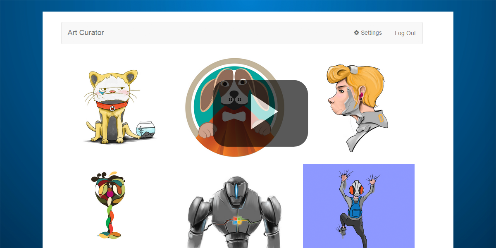

# Art Curator para Angular 

Este exemplo demonstra como usar a API de Email do Outlook para obter emails e anexos do Office 365. Ele foi criado para [iOS](https://github.com/OfficeDev/O365-iOS-ArtCurator), [Android](https://github.com/OfficeDev/O365-Android-ArtCurator), Web (aplicativo Web do Angular) e [Windows Phone](https://github.com/OfficeDev/O365-WinPhone-ArtCurator). Confira nosso [artigo sobre o Medium](https://medium.com/office-app-development) e este [vídeo com o passo a passo no YouTube](https://www.youtube.com/watch?v=M88A6VB9IIw&amp;feature=youtu.be).

O Art Curator oferece uma maneira diferente de exibir sua caixa de entrada. Imagine que você possui uma empresa que vende camisetas artísticas. Como proprietário da empresa, você recebe muitos emails de artistas com designs que eles querem que você compre. Em vez de usar o Outlook e abrir cada email individualmente, baixando a imagem anexada, e, em seguida, abrir a imagem para exibi-la, você pode usar o Art Curator para ter uma exibição prévia do anexo (../limitado aos arquivos: .jpg e .png) de sua caixa de entrada para escolher designs que você gosta de uma forma mais eficiente.

[](https://youtu.be/4LOvkweDfhY "Click to see the sample in action.")

Este exemplo demonstra as seguintes operações a partir da **API de Email do Outlook**:
* [Obter pastas](https://msdn.microsoft.com/office/office365/APi/mail-rest-operations#GetFolders)
* [Obter mensagens](https://msdn.microsoft.com/office/office365/APi/mail-rest-operations#Getmessages) (incluindo filtragem e o uso da opção selecionar) 
* [Obter anexos](https://msdn.microsoft.com/office/office365/APi/mail-rest-operations#GetAttachments)
* [Atualizar mensagens](https://msdn.microsoft.com/office/office365/APi/mail-rest-operations#Updatemessages)
* [Criar e enviar mensagens](https://msdn.microsoft.com/office/office365/APi/mail-rest-operations#Sendmessages) (com e sem anexo) 

Este exemplo também demonstra a autenticação com o Azure Active Directory usando a [ADAL (Active Directory Authentication Library) para JavaScript](https://github.com/AzureAD/azure-activedirectory-library-for-js).

<a name="prerequisites"></a>
## Pré-requisitos

Esse exemplo requer o seguinte:
* [Node.js](https://nodejs.org/). O nó é necessário para executar o exemplo em um servidor de desenvolvimento e para instalar as dependências. 
* Uma conta do Office 365. Inscreva-se em [uma assinatura de Desenvolvedor do Office 365](http://aka.ms/ro9c62) que inclui os recursos necessários para começar a criar aplicativos do Office 365.

<a name="configure"></a>
## Registrar o aplicativo

1. Para colocar este exemplo em funcionamento rapidamente, acesse a [Ferramenta de Registro do Aplicativo do Portal de Desenvolvedor do Outlook](https://dev.outlook.com/appregistration).
2. Na **Etapa 1**, entre com sua conta do Office 365 ou clique no botão para obter uma avaliação gratuita. Depois de entrar, prossiga para a próxima etapa.
3. Na **Etapa 2**, preencha o formulário com os seguintes valores.
	* *Nome do Aplicativo:* Art Curator
	* *Tipo de Aplicativo:* aplicativo de Página Única (Single-Page App, SPA)
	* *URI de Redirecionamento:* http://127.0.0.1:8080/
	* *URL da Home Page:* http://artcurator.{seu_subdominio}.com (o subdomínio de .onmicrosoft de seu locatário do Office 365)
4. Na **Etapa 3**, escolha as seguintes permissões em **API de Email**.
	* *Ler e gravar emails*
	* *Enviar email*
5. Na **Etapa 4**, clique em **Registrar Aplicativo** para registrar seu aplicativo no Azure Active Directory.
6. Por fim, copie a **ID de cliente** do formulário para usar na próxima seção.

<a name="run"></a>
## Executar o aplicativo

Abra *app/scripts/app.js* e substitua *{seu_locatario}* com o subdomínio de .onmicrosoft especificado para seu locatário do Office 365 e a ID de cliente do aplicativo do Azure registrado que você recebeu da Ferramenta de Registro do Aplicativo do Portal de Desenvolvedor do Outlook na última etapa nas linhas 46 e 47 , respectivamente. 

Em seguida, instale as dependências necessárias e execute o projeto através da linha de comando. Comece abrindo um prompt de comando e navegando para a pasta raiz. Chegando lá, siga as etapas abaixo.

1. Instalar dependências do projeto executando ```npm install```.
2. Agora que todas as dependências do projeto estão instaladas, inicie o servidor de desenvolvimento executando ```node server.js``` na pasta raiz.
3. Navegue para ```http://127.0.0.1:8080/``` em seu navegador da Web.

<a name="understand"></a>
## Compreender o código

### Conectar-se ao Office 365

Este projeto utiliza o [Azure Active Directory usando a ADAL (Azure Active Directory Library) para JavaScript](https://github.com/AzureAD/azure-activedirectory-library-for-js) na autenticação com o Azure Active Directory para solicitar e receber tokens para usar as APIs do Office 365.

O serviço está configurado no *app/app.js* na função de configuração do módulo. Em *app/controllers/navBarController.js*, há duas funções que manipulam o logon e o logoff do Azure Active Directory que também trata da adquisição de tokens. 

### API de Email

Este projeto usa chamadas REST padrão para interagir com a API de Email. Confira a [referência da API REST de Email do Outlook](https://msdn.microsoft.com/pt-br/office/office365/api/mail-rest-operations) para obter detalhes sobre os pontos de extremidade disponíveis.

A funcionalidade completa da API de Email reside em *app/controllers/mainController.js*. Primeiro, ela obtém todas as pastas disponíveis no locatário do usuário e usa o valor armazenado em *localStorage* para localizar a pasta de destino. Depois disso, ela obtém os 50 emails mais recentes que não foram lidos e têm anexos. Em seguida, chamadas são feitas para acessar o conteúdo de cada um desses anexos. Neste ponto, ela tem todos os emails e conteúdo dos anexos, e tudo isso é armazenado em uma matriz que fica disponível no modo de exibição a ser apresentado.

Outras funcionalidades disponíveis em *mainController.js* incluem a marcação de emails como lidos e a criação e envio de respostas. 

### Limitações

Os recursos a seguir não são incluídos na versão atual.

* Suporte a arquivos além de .png e .jpg
* Lidar com uma única mensagem de email com vários anexos
* Paginação (recebendo mais de 50 emails)
* Lidar com exclusividade de nome de pasta
* A pasta de envio deve ser uma pasta de nível superior

## Observação sobre segurança
[ADAL JS](https://github.com/AzureAD/azure-activedirectory-library-for-js) não valida o token recebido do Azure AD. Ele se baseia no back-end do aplicativo para fazê-lo, e até que o back-end seja chamado, você não saberá se o usuário obteve um token aceitável. Os aplicativos de negócios devem ter um componente no servidor para autenticar usuários criado no aplicativo Web por motivos de segurança. Sem essa validação do token de back-end, seu aplicativo está sujeito a violações de segurança, como [problemas de Confused Deputy](https://en.wikipedia.org/wiki/Confused_deputy_problem). Confira esta [postagem de blog](http://www.cloudidentity.com/blog/2015/02/19/introducing-adal-js-v1/) para saber mais.

<a name="questions-and-comments"></a>
## Perguntas e comentários

- Se você tiver problemas para executar este exemplo [registre um problema](https://github.com/OfficeDev/O365-Angular-ArtCurator/issues).
- Para perguntas gerais sobre as APIs do Office 365, poste no [Stack Overflow](http://stackoverflow.com/). Verifique se suas perguntas ou seus comentários estão marcados com [office365].
  
<a name="additional-resources"></a>
## Recursos adicionais

* [Create an Angular app with Office 365 APIs](http://aka.ms/get-started-with-js)
* [Visão geral da plataforma de APIs do Office 365](http://msdn.microsoft.com/office/office365/howto/platform-development-overview)
* [Centro de Desenvolvimento do Office](http://dev.office.com/)
* [Art Curator para iOS](https://github.com/OfficeDev/O365-iOS-ArtCurator)
* [Art Curator para Android](https://github.com/OfficeDev/O365-Android-ArtCurator)
* [Art Curator para Windows Phone](https://github.com/OfficeDev/O365-WinPhone-ArtCurator)

## Copyright
Copyright © 2015 Microsoft. Todos os direitos reservados.

