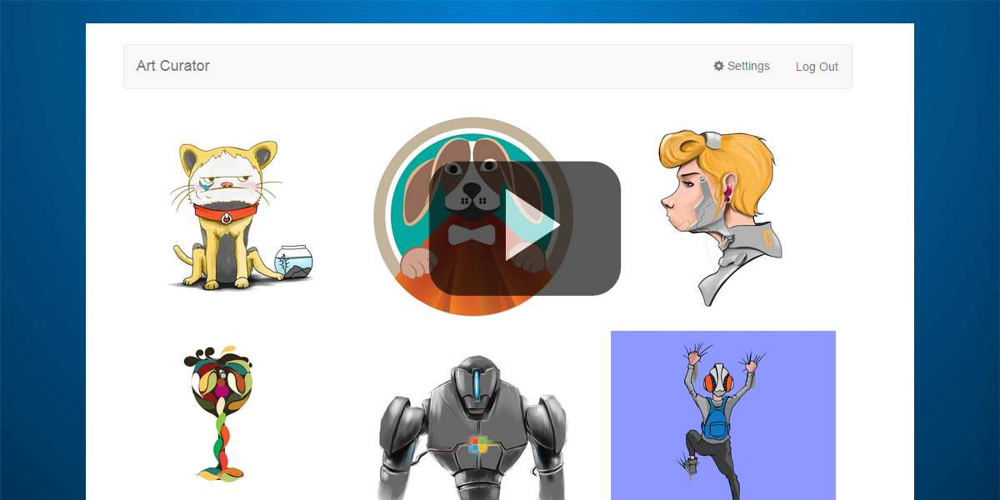

# Art Curator for Angular

此示例演示如何使用 Outlook 邮件 API 从 Office 365 获取电子邮件和附件。它为 [iOS](https://github.com/OfficeDev/O365-iOS-ArtCurator)、[Android](https://github.com/OfficeDev/O365-Android-ArtCurator)、Web（Angular Web 应用）和 [Windows Phone](https://github.com/OfficeDev/O365-WinPhone-ArtCurator) 而构建。查看我们的[媒体文章](https://medium.com/office-app-development)以及 [YouTube 上的演练视频](https://www.youtube.com/watch?v=M88A6VB9IIw&amp;feature=youtu.be)。

Art Curator 提供了一种不同的方式来查看收件箱。想象您拥有一家销售艺术 T 恤的公司。作为公司的所有者，您会收到大量艺术家发送的电子邮件，其中附有他们希望您购买的设计。您可以使用 Art Curator 让您以更加高效的方式先预览收件箱的附件（限于 .jpg 和 .png 文件）视图以选取您喜欢的设计，而不是使用 Outlook 打开每个单独的电子邮件，下载随附的图片，然后打开图片进行查看。

[](https://youtu.be/4LOvkweDfhY "Click to see the sample in action.")

此示例从“Outlook 邮件 API”****演示以下操作：
* [获取文件夹](https://msdn.microsoft.com/office/office365/APi/mail-rest-operations#GetFolders)
* [获取邮件](https://msdn.microsoft.com/office/office365/APi/mail-rest-operations#Getmessages)（包括筛选和使用选择）
* [获取附件](https://msdn.microsoft.com/office/office365/APi/mail-rest-operations#GetAttachments)
* [更新邮件](https://msdn.microsoft.com/office/office365/APi/mail-rest-operations#Updatemessages)
* [创建并发送邮件](https://msdn.microsoft.com/office/office365/APi/mail-rest-operations#Sendmessages)（带有附件和不带有附件）

此示例还演示了使用[适用于 JavaScript 的 Active Directory Authentication Library (ADAL)](https://github.com/AzureAD/azure-activedirectory-library-for-js) 对 Azure Active Directory 进行身份验证。

<a name="prerequisites"></a>
## 先决条件

该示例需要以下各项：
* [Node.js](https://nodejs.org/).需要提供节点才能在开发服务器上运行示例和安装依赖项。
* 一个 Office 365 帐户。您可以注册 [Office 365 开发人员订阅](http://aka.ms/ro9c62)，其中包含您开始构建 Office 365 应用所需的资源。

<a name="configure"></a>
## 注册应用

1.若要使此示例快速运行，请转到 [Outlook 开发人员门户应用注册工具](https://dev.outlook.com/appregistration)。
2.在“第 1 步”****中，使用您现有的 Office 365 帐户登录或单击该按钮以获取免费试用版。在您登录后，请继续执行下一步。
3.在“第 2 步”****中，使用下面的值填写表单。
	**应用名称：*Art Curator
	**应用类型：*单页应用 (SPA)
	**重定向 URI：*http://127.0.0.1:8080/
	**主页 URL：*http://artcurator.{your_subdomain}.com（您的 Office 365 租户的 .onmicrosoft 的子域）
4.在“第 3 步”****中，在“邮件 API”****下选择权限。
	**读取和写入邮件*
	**发送邮件*
5.在“第 4 步”****中，单击“注册应用”****来在 Azure Active Directory 中注册您的应用程序。
6.最后，复制表单的“客户端 ID”****以便在下一节中使用。

<a name="run"></a>
## 运行应用

打开 *app/scripts/app.js* 并分别用您为 Office 365 租户指定的 .onmicrosoft 的子域以及您接收自上一步中 46 和 47 行的 Outlook 开发人员门户应用注册工具的注册 Azure 应用程序的客户端 ID 替换 *{your_tenant}*。

下一步，安装必要的依赖项，并通过命令行运行该项目。首先，打开命令提示符，并导航到根文件夹。然后，执行下列步骤。

1.通过运行 ```npm install``` 安装项目依赖项。
2.现在，安装了所有项目依赖项，通过在根文件夹中运行 ```node server.js``` 开始开发服务器。
3.在您的 Web 浏览器中导航到 ```http://127.0.0.1:8080/```。

<a name="understand"></a>
## 了解代码

### 连接到 Office 365

此项目使用[使用适用于 JavaScript 的 Azure Active Directory Library (ADAL) 的 Azure Active Directory](https://github.com/AzureAD/azure-activedirectory-library-for-js)来对 Azure Active Directory 进行身份验证以便为使用 Office 365 API 请求和检索令牌。

在模块配置的 *app/app.js* 中配置服务。在 *app/controllers/navBarController.js* 中，有两个函数可以处理 Azure Active Directory 的登录和注销，还可以处理获取令牌。

### 邮件 API

此项目使用标准 REST 调用来与邮件 API 进行交互。请参阅 [Outlook 邮件 REST API 参考](https://msdn.microsoft.com/en-us/office/office365/api/mail-rest-operations)，了解有关可用终结点的详细信息。

邮件 API 的所有功能都保留在 *app/controllers/mainController.js* 中。首先，它获取用户租户中所有可用的文件夹，使用 *localStorage* 中存储的值来查找目标文件夹。在此之后，它将获取 50 封未读且包含附件的最新电子邮件。然后，进行调用以获取每个附件的内容。此时，它拥有所有电子邮件以及附件的内容，它们存储在一个可显示视图的数组中。

*mainController.js* 中包含了其他功能，例如，将电子邮件标记为已读，和创建和发送响应。

### 限制

当前版本中不包括以下的功能。

*文件支持不再局限于 .png 和 .jpg
*处理带有多个附件的单个电子邮件
*分页（获取超过 50 个电子邮件）
*处理文件夹名称唯一性
*提交文件夹必须是顶级文件夹

## 安全通知
[ADAL JS](https://github.com/AzureAD/azure-activedirectory-library-for-js) 不会对接受自 Azure AD 的令牌进行验证。它依赖于应用的后端执行此操作，并且直到您调用后端时，您还不知道用户是否获得可接受的令牌。出于安全原因，业务应用程序应该具有服务器端组件以便将用户身份验证内置于 Web 应用程序中。不经过后端令牌验证，您的应用容易受到安全攻击，如[混淆代理人问题](https://en.wikipedia.org/wiki/Confused_deputy_problem)。查看此[博客文章](http://www.cloudidentity.com/blog/2015/02/19/introducing-adal-js-v1/)，了解详细信息。

<a name="questions-and-comments"></a>
## 问题和意见

- 如果您在运行此示例时遇到任何问题，请[记录问题](https://github.com/OfficeDev/O365-Angular-ArtCurator/issues)。
- 对于有关 Office 365 API 的常规问题，请发布到 [Stack Overflow](http://stackoverflow.com/)。请确保您的问题或意见使用 [office365] 进行标记。
 
<a name="additional-resources"></a>
## 其他资源

* [使用 Office 365 API 创建 Angular 应用](http://aka.ms/get-started-with-js)
* [Office 365 API 平台概述](http://msdn.microsoft.com/office/office365/howto/platform-development-overview)
* [Office 开发人员中心](http://dev.office.com/)
* [Art Curator for iOS](https://github.com/OfficeDev/O365-iOS-ArtCurator)
* [Art Curator for Android](https://github.com/OfficeDev/O365-Android-ArtCurator)
* [Art Curator for Windows Phone](https://github.com/OfficeDev/O365-WinPhone-ArtCurator)

## 版权所有
版权所有 (c) 2015 Microsoft。保留所有权利。

