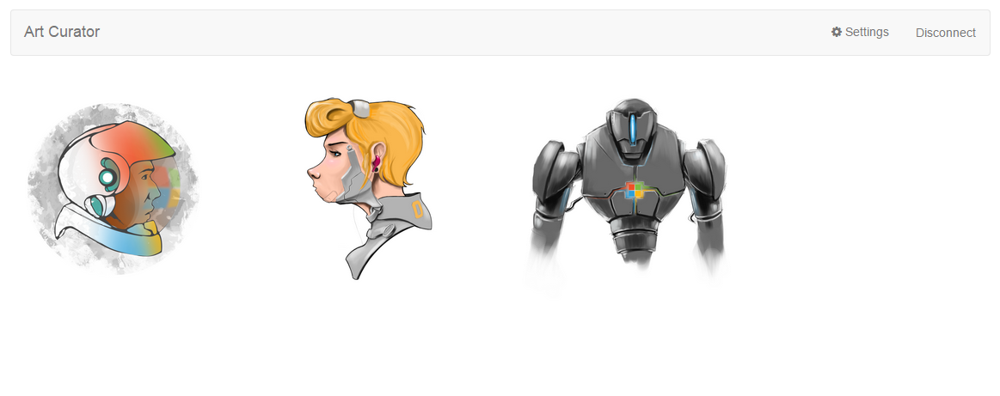

# Art Curator for Web 

This sample demonstrates how to use the Outlook Mail API to get emails and attachments from Office 365. It's built for [iOS](https://github.com/OfficeDev/O365-iOS-ArtCurator), [Android](https://github.com/OfficeDev/O365-Android-ArtCurator), Web (Angular web app), and [Windows Phone](https://github.com/OfficeDev/O365-WinPhone-ArtCurator).

Art Curator is a different way to view your inbox. Imagine you own a company that sells artistic t-shirts. As the owner of the company, you receive lots of emails from artists with designs they want you to buy. Instead of using Outlook and opening every individual email, downloading the attached picture, and then opening it to view, you can use Art Curator to give you an attachment-first (limited to .jpg and .png files) view of your inbox to pick and choose designs you like in a more efficient way.



This sample demonstrates the following operations from the **Outlook Mail API**:
* [Get folders](https://msdn.microsoft.com/office/office365/APi/mail-rest-operations#GetFolders)
* [Get messages](https://msdn.microsoft.com/office/office365/APi/mail-rest-operations#Getmessages) (including filtering and using select) 
* [Get attachments](https://msdn.microsoft.com/office/office365/APi/mail-rest-operations#GetAttachments)
* [Update messages](https://msdn.microsoft.com/office/office365/APi/mail-rest-operations#Updatemessages)
* [Create and send messages](https://msdn.microsoft.com/office/office365/APi/mail-rest-operations#Sendmessages) (with and without an attachment) 

This sample also demonstrates authentication with Azure Active Directory using [Active Directory Authentication Library (ADAL) for JavaScript](https://github.com/AzureAD/azure-activedirectory-library-for-js).

<a name="prerequisites"></a>
## Prerequisites

This sample requires the following:
* [Node.js](https://nodejs.org/). Node is required to run the sample on a development server and to install dependencies. 
* An Office 365 account. You can sign up for [an Office 365 Developer subscription](http://aka.ms/ro9c62) that includes the resources that you need to start building Office 365 apps.
* A Microsoft Azure tenant to register your application. Azure Active Directory provides identity services that applications use for authentication and authorization. A trial subscription can be acquired here: [Microsoft Azure](http://aka.ms/jjm0q7).

**Note**  You will also need to ensure your Azure subscription is bound to your Office 365 tenant. Check out the Active Directory team's blog post, [Creating and Managing Multiple Windows Azure Active Directories](http://aka.ms/lrb3ln) for instructions. In this post, the *Adding a new directory* section will explain how to do this. You can also read [Set up Azure Active Directory access for your Developer Site](http://aka.ms/fv273q) for more information.

<a name="configure"></a>
## Register and configure the app

1. Sign in to the [Azure Management Portal](https://manage.windowsazure.com/) using your Office 365 Developer Site credentials.

2. Click the **Active Directory** node in the left column and select the directory linked to your Office 365 subscription.

3. Select the **Applications** tab and then **Add** at the bottom of the screen.

4. On the pop-up, select **Add an application my organization is developing**. Then click the arrow to continue. 

5. Choose a name for the app, such as *ArtCurator*, and select **Web application and/or web API** as its **Type**. Then click the arrow to continue.

6. The value of **Sign-on URL** is the URL where the application will be hosted. Use *http://localhost:8080/* for the sample project.

7. The value of **App ID URI** is a unique identifier for Azure AD to identify the app. You can use http://{your_subdomain}/ArtCurator, where {your_subdomain} is the subdomain of .onmicrosoft you specified while signing up for your Office 365 Developer Site. Then click the check mark to provision the application.

8. Once the application is successfully added, the Quick Start page for the application appears. From here, select the **Configure** tab.

9. Scroll down to the **permissions to other applications** section and click the **Add application** button.

10. In this tutorial, we'll demonstrate how to get a user's email so add the **Office 365 Exchange Online** application. Click the plus sign in the application's row and then click the check mark at the top right to add it. Then click the check mark at the bottom right to continue.

11. In the **Office 365 Exchange Online** row, select **Delegated Permissions**, and in the selection list, choose **Read and write user mail** and **Send mail as a user**.

12. Click **Save** to save the app's configuration.

### Configure the app to allow the OAuth 2.0 implicit grant flow

In order to get an access token for Office 365 API requests, the application will use the OAuth implicit grant flow. You need to update the application's manifest to allow the OAuth implicit grant flow because it is not allowed by default. 

1. Select the **Configure** tab of the application's entry in the Azure Management Portal. 

2. Using the **Manage Manifest** button in the drawer, download the manifest file for the application and save it to the computer.

3. Open the manifest file with a text editor. Search for the *oauth2AllowImplicitFlow* property. By default it is set to *false*; change it to *true* and save the file.

4. Using the **Manage Manifest** button, upload the updated manifest file.

<a name="run"></a>
## Run the app

Open *app/scripts/app.js* and replace *{your_subdomain}* with the subdomain of .onmicrosoft you specified for your Office 365 tenant and the client ID of your registered Azure application on lines 46 and 47, respectively. 

Next, install the necessary dependencies and run the project via the command line. Begin by opening a command prompt and navigating to the root folder. Once there, follow the steps below.

1. Install project dependencies by running ```npm install```.
2. Now that all the project dependencies are installed, start the development server by running ```node server.js``` in the root folder.
3. Navigate to ```http://localhost:8080/``` using Google Chrome.

**Note** Because cookies are not accessible in Internet Explorer while your app is running in localhost, you'll need to use a different browser, such as Google Chrome, to test your application.

<a name="understand"></a>
## Understand the code

### Connect to Office 365

This project uses [Azure Active Directory using Azure Active Directory Library (ADAL) for JavaScript](https://github.com/AzureAD/azure-activedirectory-library-for-js) to authenticate with Azure Active Directory in order to request and receive tokens for using the Office 365 APIs.

The service is configured in *app/app.js* in the module's config function. In *app/controllers/navBarController.js*, there are two functions that handle logging in and out of Azure Active Directory which handles acquiring tokens as well. 

### Mail API

This project uses standard REST calls to interact with the Mail API. Refer to the [Outlook Mail REST API reference](https://msdn.microsoft.com/en-us/office/office365/api/mail-rest-operations) for details on the available endpoints.

All of the Mail API functionality lives in *app/controllers/mainController.js*. First, it gets all of the folders available on the user's tenant and uses the stored value in *localStorage* to find the target folder. After that, it gets the 50 most recent emails that are unread and have attachments. Then, calls are made to get the content of each of those attachments. At this point, it has all of the emails and contents of the attachments and they are stored in an array that is made available to the view for display.

Other functionality included in *mainController.js* includes marking emails as read and creating and sending responses. 

### Limitations

The following features are not included in the current version.

* File support beyond .png and .jpg
* Handling a single email with multiple attachments
* Paging (getting more than 50 emails)
* Handling folder name uniqueness
* Submission folder must be a top-level folder

<a name="questions-and-comments"></a>
## Questions and comments

- If you have any trouble running this sample, please [log an issue](https://github.com/OfficeDev/O365-Angular-Art-Curator/issues).
- For all other questions and comments, send an email to [docthis@microsoft.com](mailto:docthis@microsoft.com?subject=Feedback%20on%20Art%20Curator%20for%20Angular).
- For general questions about the Office 365 APIs, post to [StackOverflow](http://stackoverflow.com/). Make sure that your questions or comments are tagged with [office365].
  
<a name="additional-resources"></a>
## Additional resources

* [Get started with Office 365 APIs in JavaScript web applications](http://aka.ms/get-started-with-js)
* [Office 365 APIs platform overview](http://msdn.microsoft.com/office/office365/howto/platform-development-overview)
* [Office Dev Center](http://dev.office.com/)
* [Art Curator for iOS](https://github.com/OfficeDev/O365-iOS-ArtCurator)
* [Art Curator for Android](https://github.com/OfficeDev/O365-Android-ArtCurator)
* [Art Curator for Windows Phone](https://github.com/OfficeDev/O365-WinPhone-ArtCurator)

## Copyright
Copyright (c) 2015 Microsoft. All rights reserved.